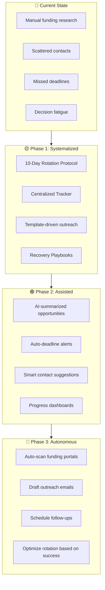
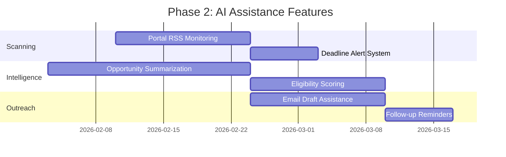
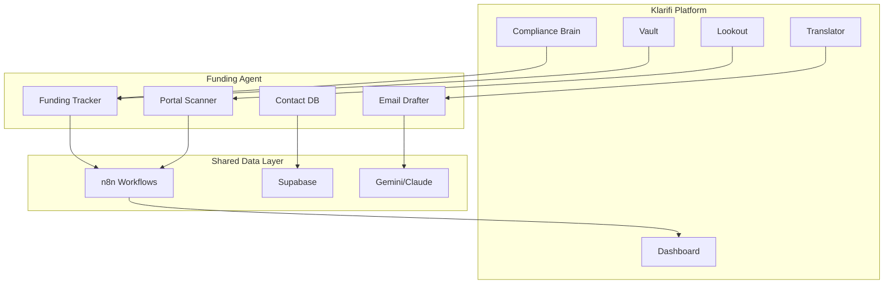
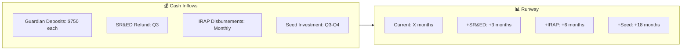

# Agentic Roadmap
## Klarifi: From MVP to Sustainable Funding Engine

**Version:** 1.0  
**Created:** January 13, 2026  
**Vision:** Build an autonomous "Second Brain" that turns funding pursuit into a systematic, low-friction daily habit.

---

## 1. Roadmap Philosophy



---

## 2. Phase 1: Systematized Human Protocol (Weeks 1-4)

### Objective
Convert founder's scattered funding efforts into a repeatable 15-minute daily habit.

### Deliverables

| Deliverable | Status | Owner | Due |
|-------------|--------|-------|-----|
| Funding Strategy Map | ✅ Complete | AI | Jan 13 |
| Daily Agent Protocol | ✅ Complete | AI | Jan 13 |
| Daily Funding Tracker | ✅ Complete | AI | Jan 13 |
| Master Contact Database | ✅ Complete | AI | Jan 13 |
| Recovery Playbooks | ✅ Complete | AI | Jan 13 |
| First 10-Day Cycle | ⏳ In Progress | Founder | Jan 22 |

### Success Metrics

| Metric | Target | Tracking |
|--------|--------|----------|
| Daily Protocol Adherence | 80%+ (4/5 weekdays) | Tracker log |
| External Touchpoints/Week | 3-5 | Outreach log |
| Funding Sources Active | 8+ | Tracker status |
| Contacts Added/Week | 3-5 | Contact database |

### Risks & Mitigations

| Risk | Mitigation |
|------|------------|
| Founder skips days | Buffer day catch-up + low-friction recovery |
| Information scattered | All docs in single `/funding-brain/` folder |
| Decision paralysis | Rotation decides, not founder |

---

## 3. Phase 2: AI-Assisted Funding Agent (Weeks 5-12)

### Objective
Augment the manual protocol with AI capabilities that reduce friction and increase intelligence.

### Capability Roadmap



### Feature Specifications

#### 2.1 Portal Monitoring Agent

**Function:** Daily scan of funding portals for new opportunities

**Sources:**
- Innovation Canada Portal
- ISC Challenges
- IRAP News
- Provincial innovation hubs

**Output:** Markdown summary in `/funding-brain/daily_scan.md`

```markdown
## Daily Funding Scan - [Date]

### 🆕 New Opportunities (3)
1. **ISC Challenge: Healthcare Privacy** - Deadline: Mar 15
   - Fit Score: 85%
   - Guardian alignment: Strong (edge AI + privacy)
   
2. **LSIF Spring Cohort** - Deadline: Feb 28
   - Fit Score: 70%
   - Requires: Clinical validation partner

### ⚠️ Deadline Alerts (1)
- IRAP Inquiry response due: Jan 20 (7 days)

### 📊 Source Status Changes
- Velocity applications: NOW OPEN
```

#### 2.2 Smart Tracker Updates

**Function:** Auto-populate tracker with AI-extracted data

**Triggers:**
- Email received from program → Update status
- Calendar event → Log meeting
- Document saved to knowledge-base → Parse and tag

#### 2.3 Outreach Draft Assistant

**Function:** Generate personalized email drafts based on templates + context

**Input:** Contact + funding source + current status
**Output:** Draft email ready for founder review

---

## 4. Phase 3: Autonomous Funding Engine (Months 4-6)

### Objective
Evolve toward an AI agent that operates the funding protocol with minimal human intervention.

### Autonomous Capabilities

| Capability | Human Role | AI Role |
|------------|------------|---------|
| Opportunity Discovery | Approve/reject | Scan, filter, score, summarize |
| Eligibility Assessment | Confirm edge cases | Analyze requirements, flag gaps |
| Outreach Drafting | Edit and send | Draft, suggest timing, track opens |
| Follow-up Management | Review escalations | Schedule, remind, auto-bump |
| Progress Reporting | Read weekly summary | Generate dashboards, insights |
| Strategy Optimization | Set goals | Recommend rotation adjustments |

### Autonomous Daily Protocol

```mermaid
sequenceDiagram
    participant Clock as 8:00 AM Trigger
    participant Agent as Funding Agent
    participant Human as Founder
    participant World as External Systems
    
    Clock->>Agent: Execute daily protocol
    
    rect rgb(50, 80, 50)
    Note over Agent: Phase 1: Auto-Scan
    Agent->>World: Check Innovation Canada
    Agent->>World: Check ISC
    Agent->>World: Check email for replies
    World-->>Agent: New data
    Agent->>Agent: Update tracker
    end
    
    rect rgb(50, 50, 80)
    Note over Agent: Phase 2: Generate Tasks
    Agent->>Agent: Check rotation day
    Agent->>Agent: Draft today's email
    Agent->>Agent: Prepare summary
    end
    
    rect rgb(80, 50, 50)
    Note over Agent: Phase 3: Human Review
    Agent->>Human: Morning briefing notification
    Human-->>Agent: Approve/edit email
    end
    
    rect rgb(80, 80, 50)
    Note over Agent: Phase 4: Execute
    Agent->>World: Send approved email
    Agent->>Agent: Log completion
    Agent->>Human: End of session summary
    end
```



---

## 5. Integration with Klarifi Platform

### Synergy Opportunities

| Platform Feature | Funding Integration |
|------------------|---------------------|
| **Compliance Brain (Thoughts)** | Capture funding ideas → Auto-classify → Add to backlog |
| **Vault (Audit Trail)** | Log all funding activities for investor due diligence |
| **Translator (AI Q&A)** | Answer funding program eligibility questions |
| **Lookout (Monitoring)** | Monitor funding news alongside regulatory news |
| **Dashboard** | Add "Funding Health" widget alongside compliance score |

### Technical Architecture



---

## 6. Sustainable Funding Cadence

### Monthly Rhythm

```
Week 1: IRAP + SR&ED focus (government programs)
Week 2: Hospital + Academic outreach (partnerships)
Week 3: Accelerator + Investor prep (equity/acceleration)
Week 4: Review + Strategy adjustment (optimization)
```

### Quarterly Milestones

| Quarter | Funding Target | Key Activities |
|---------|----------------|----------------|
| Q1 2026 | $150K | IRAP approval, SR&ED prep, Velocity app |
| Q2 2026 | $300K | Hospital pilot, ISC challenge, Angel intro |
| Q3 2026 | $500K | Seed round open, Guardian ship, Case studies |
| Q4 2026 | $1M+ | Seed close, IRAP Phase 2, Enterprise deals |

### Runway Management



---

## 7. Risk Matrix & Contingencies

### Funding Portfolio Risk Distribution

| Risk Level | Sources | Mitigation |
|------------|---------|------------|
| 🟢 Low | SR&ED (retroactive, predictable) | Begin tracking immediately |
| 🟡 Medium | IRAP, Velocity (competitive but good fit) | Multiple applications in flight |
| 🔴 High | ISC, Hospital contracts (long sales cycles) | Don't depend solely on these |

### Scenario Planning

| Scenario | Trigger | Response |
|----------|---------|----------|
| **IRAP Rejection** | Application denied | Reapply next quarter + shift to Velocity |
| **Hospital Stall** | No pilot by Q2 | Pivot to pharmacy chains as alternative |
| **Seed Round Slow** | <50% committed by Aug | Extend runway via BDC loan, cut burn |
| **Guardian Delay** | Manufacturing issues | Refund deposits, focus on SaaS revenue |

---

## 8. Key Decisions Requiring Founder Input

> [!IMPORTANT]
> The following strategic decisions should be made before proceeding to execution.

### Decision 1: Primary Funding Focus

**Question:** Which Tier 1 source gets 40% of energy in Q1?

| Option | Pro | Con |
|--------|-----|-----|
| IRAP | Largest potential ($500K+) | Longer approval cycle |
| Velocity | Fast, includes mentorship | Lower funding amount |
| ISC | Government contract credibility | Highly competitive |

**Recommended:** IRAP (best fit for Edge AI R&D)

---

### Decision 2: Hospital Partnership Strategy

**Question:** Which hospital to target first for Guardian pilot?

| Option | Pro | Con |
|--------|-----|-----|
| UHN | Largest, most active innovation | Hardest to get meeting |
| Sunnybrook | Strong digital health focus | Smaller pharmacy footprint |
| Community Hospital | Faster decision cycle | Less credible for fundraising |

**Recommended:** UHN as aspirational, Sunnybrook as realistic first target

---

### Decision 3: Accelerator Timing

**Question:** Apply to Velocity in Q1 or wait for more traction?

| Option | Pro | Con |
|--------|-----|-----|
| Apply Now | Get support earlier | Weaker application without customers |
| Wait 90 Days | Stronger with pilot data | Miss current cohort |

**Recommended:** Apply now; Guardian pre-orders are validation

---

## 9. Implementation Checklist

### Week 1 (Jan 13-19)

- [x] Create funding strategy map
- [x] Create daily agent protocol
- [x] Create funding tracker
- [x] Create contact database
- [ ] **FOUNDER:** Execute Day 1 (IRAP) protocol
- [ ] **FOUNDER:** Begin SR&ED time tracking
- [ ] **FOUNDER:** Review and approve roadmap

### Week 2 (Jan 20-26)

- [ ] Complete first 10-day rotation cycle
- [ ] First hospital lead identified
- [ ] Velocity application drafted
- [ ] 5+ external touchpoints logged

### Week 3-4 (Jan 27 - Feb 9)

- [ ] IRAP ITA meeting scheduled
- [ ] SR&ED documentation system running
- [ ] First investor demo scheduled
- [ ] Cycle 2 begins with adjusted priorities

---

## 10. Next Steps

1. **Founder Review:** Approve this roadmap and strategy documents
2. **Execute Day 1:** Begin IRAP protocol today (Jan 13)
3. **Daily Habit:** 15 minutes at 8:00 AM, follow the rotation
4. **Weekly Check-in:** Every Friday, review metrics and adjust
5. **Phase 2 Kickoff:** Feb 3, begin AI assistance features

---

*Agentic Roadmap v1.0 - Building the funding engine that runs itself*
