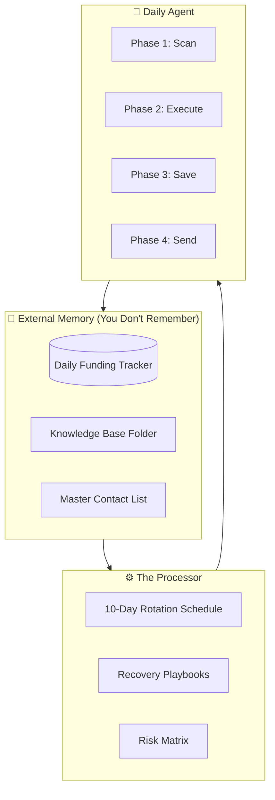
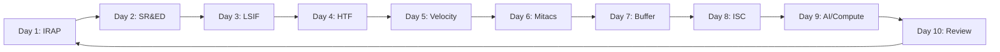

# Daily Agent Protocol
## The "Second Brain" Execution System for Klarifi Funding

**Protocol Version:** 1.0  
**Trigger Time:** 8:00 AM Daily  
**Duration:** 15 Minutes  
**Objective:** Advance 10 funding streams simultaneously without decision fatigue

---

## 1. Second Brain Architecture



### File Structure

```
/funding-brain/
├── daily_funding_tracker.md       # The Database
├── funding_strategy_map.md        # The Strategy
├── master_contacts.md             # The Rolodex
├── recovery_playbooks.md          # Error Handlers
├── /knowledge-base/
│   ├── irap_guidelines.pdf
│   ├── sred_sr-ed-guide.pdf
│   ├── lsif_eligibility.pdf
│   ├── velocity_application.pdf
│   └── isc_challenges_q1.pdf
└── /pitch-assets/
    ├── klarifi_deck_v1.pdf
    └── guardian_one_pager.pdf
```

---

## 2. The 10-Day Rotation Cycle

> [!IMPORTANT]
> **Rule:** You do NOT decide what to work on. The rotation decides. Your only job is to execute the micro-task for today's funding source.



### Today's Protocol (Monday, January 13, 2026)

**Cycle Day:** Day 3 (Week 2, Rotation 1)  
**Focus:** Life Sciences Innovation Fund (LSIF)

---

## 3. Daily Rotation Detailed Tasks

### Day 1: IRAP (NRC Industrial Research Assistance Program)

| Priority | Micro-Task | Output |
|----------|------------|--------|
| **A** | Email NRC-IRAP for ITA assignment status | Email sent ✓ |
| **B** | Draft one section of proposal narrative | 250 words in doc |
| **C** | Review ITA feedback notes | Notes summarized |

**Template Email:**
```
Subject: Klarifi - ITA Assignment Follow-up

Dear [ITA Name],

Following up on our inquiry regarding Klarifi's Edge AI development 
for healthcare compliance. We're developing Guardian, a medication 
adherence monitoring device with privacy-first edge processing.

Key R&D activities:
- Edge AI model optimization for on-device inference
- Privacy-preserving data aggregation methods
- Real-time medication event classification

Could we schedule a brief call to discuss eligibility?

Best,
[Founder Name]
```

---

### Day 2: SR&ED (Scientific Research & Experimental Development)

| Priority | Micro-Task | Output |
|----------|------------|--------|
| **A** | Log yesterday's R&D activities in time tracker | Time entries ✓ |
| **B** | Document one technical uncertainty resolved | 1 paragraph |
| **C** | Tag code commits with SR&ED project codes | Commits tagged |

**Daily SR&ED Log Template:**
```markdown
## SR&ED Activity Log - [Date]

### Technical Uncertainty Addressed:
[What didn't we know how to do?]

### Systematic Investigation:
[What experiments/approaches did we try?]

### Technological Advancement:
[What new knowledge was gained?]

### Time Spent: X hours
### Team Members: [Names]
### Project Code: KLARIFI-GUARDIAN-2026
```

---

### Day 3: LSIF (Life Sciences Innovation Fund)

| Priority | Micro-Task | Output |
|----------|------------|--------|
| **A** | Research one specific LSIF guideline | Notes captured |
| **B** | Check eligibility criteria for Guardian | Yes/No + notes |
| **C** | Identify required partnerships | List partners |

**Key LSIF Questions:**
- Does Guardian medication adherence fit "life sciences"?
- What clinical validation is required?
- Is hospital pilot sufficient for application?

---

### Day 4: HTF (Hospital Technology Fund/Partnerships)

| Priority | Micro-Task | Output |
|----------|------------|--------|
| **A** | Research one innovation lead at target hospital | Contact found |
| **B** | Draft intro email using warm connection | Draft ready |
| **C** | Review recent hospital RFPs | RFP notes |

**Hospital Targeting Priority:**
1. UHN (Toronto) - Largest, most active innovation
2. Sunnybrook - Digital health focus
3. Hamilton Health Sciences - Academic connection
4. SickKids - Pediatric differentiation

---

### Day 5: Velocity (Accelerator Programs)

| Priority | Micro-Task | Output |
|----------|------------|--------|
| **A** | Refine one slide of pitch deck | Slide improved |
| **B** | Research university partner requirements | Notes captured |
| **C** | Practice 60-second pitch | Recording done |

**Velocity Program Checklist:**
- [ ] McMaster program review
- [ ] UofT Entrepreneurship review
- [ ] Waterloo Velocity review
- [ ] Application deadlines captured

---

### Day 6: Mitacs

| Priority | Micro-Task | Output |
|----------|------------|--------|
| **A** | Search for potential academic supervisor | 1 professor ID'd |
| **B** | Review Mitacs accelerate requirements | Notes captured |
| **C** | Draft partnership pitch email | Draft ready |

**Ideal Mitacs Partner Profile:**
- Computer Science or Biomedical Engineering dept
- Research in: Edge AI, Health Informatics, NLP
- Existing industry partnership track record

---

### Day 7: Buffer Day (Catch-up/Deep Work)

| Priority | Micro-Task | Output |
|----------|------------|--------|
| **A** | Work on most pressing deadline | Progress made |
| **B** | Clear any "Waiting on Reply" items | Follow-ups sent |
| **C** | Update tracker with week's progress | Tracker current |

---

### Day 8: ISC (Innovative Solutions Canada)

| Priority | Micro-Task | Output |
|----------|------------|--------|
| **A** | Check for new healthcare challenges | Opportunities logged |
| **B** | Review one challenge's requirements | Fit assessment |
| **C** | Tag relevant Guardian capabilities | Capability map |

**ISC Challenge Categories to Monitor:**
- Healthcare delivery improvement
- Privacy and security
- Medical device innovation
- Digital health transformation

---

### Day 9: NSERC / AI Compute Access

| Priority | Micro-Task | Output |
|----------|------------|--------|
| **A** | Verify NSERC Alliance eligibility | Eligible Y/N |
| **B** | Check AI Compute Access Fund status | Application open? |
| **C** | Estimate compute needs for SLM training | Requirements doc |

---

### Day 10: System Review (Weekly Retrospective)

| Priority | Micro-Task | Output |
|----------|------------|--------|
| **A** | Review all 9 funding sources progress | Status summary |
| **B** | Update Risk Mitigation Matrix | Risks updated |
| **C** | Adjust next cycle priorities | Next week plan |

**Metrics to Review:**
- Emails sent vs. replies received
- Applications in progress
- Deadlines in next 30/60/90 days
- Contacts added this cycle

---

## 4. The 15-Minute Execution Script

```mermaid
sequenceDiagram
    participant Agent as Daily Agent
    participant Brain as Second Brain
    participant World as External World
    
    rect rgb(50, 50, 80)
    Note over Agent,Brain: Phase 1: Scan (Min 1-3)
    Agent->>Brain: Open Tracker + Portal
    Brain-->>Agent: Deadline flags, new opportunities
    Agent->>Brain: Log urgent items
    end
    
    rect rgb(50, 80, 50)
    Note over Agent,Brain: Phase 2: Execute (Min 4-7)
    Agent->>Brain: Check rotation day
    Brain-->>Agent: Today = [Funding Source]
    Agent->>Agent: Execute micro-task
    end
    
    rect rgb(80, 50, 50)
    Note over Agent,Brain: Phase 3: Save (Min 8-12)
    Agent->>Brain: Update Tracker
    Agent->>Brain: Log contacts
    Agent->>Brain: Change status
    end
    
    rect rgb(80, 80, 50)
    Note over Agent,World: Phase 4: Send (Min 13-15)
    Agent->>World: Send 1 outreach
    World-->>Agent: Session complete
    end
```



### Phase 1: Input & Scan (Minutes 1-3)

**Actions:**
1. Open Innovation Canada Portal
2. Open `daily_funding_tracker.md`
3. Scan for new calls for proposals

**Agent Logic:**
```
IF deadline < 90 days:
    Mark row as "Urgent" 🔴
    
IF new opportunity found:
    Add to "Backlog" column
    
IF reply received overnight:
    Update status to "In Progress"
```

---

### Phase 2: Deep Processing (Minutes 4-7)

**Actions:**
1. Look up today's date → Rotation Day
2. Execute ONLY the assigned micro-task
3. Do not think about other funding sources

**Key Principle:** Single-threaded focus. The rotation decides, you execute.

---

### Phase 3: Archive & Commit (Minutes 8-12)

**Actions:**
1. Log the action taken in tracker
2. Update status:
   - `To Do` → `In Progress`
   - `In Progress` → `Waiting on Reply`
   - `Waiting on Reply` → `Complete` or `Blocked`
3. Add new contacts to `master_contacts.md`

**Status Codes:**
| Code | Meaning |
|------|---------|
| 📋 | To Do |
| 🔄 | In Progress |
| ⏳ | Waiting on Reply |
| ✅ | Complete |
| 🚫 | Blocked/Rejected |
| ⭐ | Hot Lead |

---

### Phase 4: Output Transmission (Minutes 13-15)

**Actions:**
1. Draft one email using templates
2. Use Recovery Playbook scripts for messaging
3. Click send
4. Session over

**Weekly Outreach Target:** 3-5 external touchpoints

---

## 5. Recovery Playbooks (Error Handlers)

> [!CAUTION]
> These are pre-programmed responses to common "exceptions" that would otherwise derail the daily protocol.

### IF: You Miss a Day

```
DO NOT double up.
Resume the rotation exactly where you left off.

Example:
- Missed Day 4 (HTF) on Thursday
- Friday = Day 4 (HTF), not Day 5
- The cycle extends, it doesn't skip
```

### IF: You Feel Stuck

```
Execute a "Low-Friction Action" only:

GOOD: Read one guideline section
GOOD: Update one contact row
GOOD: Send one short email

BAD: Attempt a "Deep Dive"
BAD: Try to "catch up"
BAD: Switch to a different funding source
```

### IF: A Rejection Arrives

```
1. Take a breath (30 seconds)
2. Open Risk Mitigation Matrix
3. Update rejected source status
4. Identify next Tier 1 source
5. Shift energy allocation

DO NOT:
- Ruminate
- Send angry reply
- Abandon the entire cycle
```

### IF: Deadline < 7 Days

```
OVERRIDE normal rotation.
Enter "Deadline Sprint Mode":

Day -7 to -5: Draft completion
Day -4 to -3: Review and polish
Day -2: Final checks
Day -1: Submit
Day 0: Celebrate or contingency

Return to normal rotation after submission.
```

### IF: Hot Lead Emerges

```
Mark as ⭐ in tracker.
Add to "Buffer Day" priority list.
DO NOT disrupt today's rotation.

Exception: If lead requires <24 hour response,
execute quick response in Phase 4 (send slot).
```

---

## 6. Templates & Scripts

### General Inquiry Email

```markdown
Subject: [Your Company] - [Program Name] Eligibility Inquiry

Dear [Program Manager/Title],

I'm the founder of Klarifi, a Canadian healthcare compliance 
SaaS platform. We're developing [specific product/feature] 
to address [specific problem].

I'm writing to inquire about [Program Name] eligibility for 
our [R&D work / project / partnership needs].

Key details:
- Company: Canadian-incorporated, Ontario-based
- Stage: Pre-seed, [X] pre-orders secured
- Technology: [Brief description]
- Timeline: [Relevant timeline]

Would you be available for a brief call to discuss fit?

Best regards,
[Name]
[Email]
[Phone]
```

### Follow-Up Email (Waiting > 7 days)

```markdown
Subject: Re: [Original Subject]

Hi [Name],

Following up on my note from [date]. I understand you're 
busy, so I'll keep this brief.

[One sentence reminder of ask]

Happy to work around your schedule. Would next week work?

Thanks,
[Name]
```

### Hospital Partnership Intro

```markdown
Subject: Pilot Proposal - [Hospital] + Klarifi Guardian

Dear [Innovation Lead],

I'm reaching out regarding a potential pilot partnership 
between [Hospital Name] and Klarifi for our Guardian 
medication adherence monitoring system.

Guardian uses edge AI to:
- Monitor medication adherence in real-time
- Maintain 100% PHIPA compliance (no PHI leaves the device)
- Reduce nursing hours by 8+ weekly
- Create automated audit trails

We're offering a zero-risk 90-day pilot to validate our 
claimed 948% Year 1 ROI.

Could I share a 5-minute video demo?

Best,
[Name]
```

---

## 7. Agent Memory Persistence

### Daily Tracker Update Format

```markdown
| Date       | Day# | Source   | Action Taken              | Status | Next Step           |
|------------|------|----------|---------------------------|--------|---------------------|
| 2026-01-13 | D3   | LSIF     | Reviewed eligibility page | 🔄     | Check clinical reqs |
| 2026-01-12 | D2   | SR&ED    | Logged 6 hrs R&D          | 🔄     | Tag commits         |
| 2026-01-11 | D1   | IRAP     | Sent ITA inquiry email    | ⏳     | Wait for response   |
```

### Contact Log Format

```markdown
| Name | Organization | Role | Email | Phone | Added | Last Contact | Notes |
|------|--------------|------|-------|-------|-------|--------------|-------|
```

---

## 8. Success Metrics

### Daily Success = Protocol Completion

```
✅ 15 minutes executed
✅ Tracker updated
✅ 1 external signal sent
```

### Weekly Success = 4+ Days Completed

```
Target: 4 of 7 days minimum
Stretch: 6 of 7 days
Failure: < 3 days
```

### Cycle Success (10 days) = All Sources Touched

```
Each funding source: At least 1 touchpoint
Outreach: 3-5 external contacts
Tracker: 100% current
```

---

*Protocol v1.0 - Execute daily at 8:00 AM. Trust the system.*
