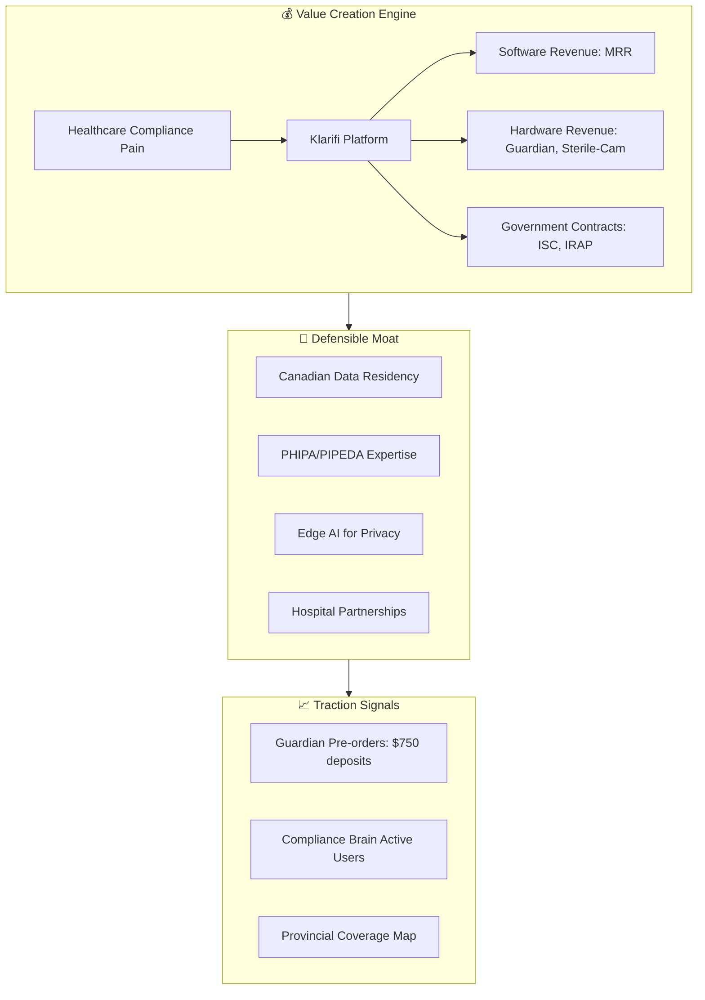
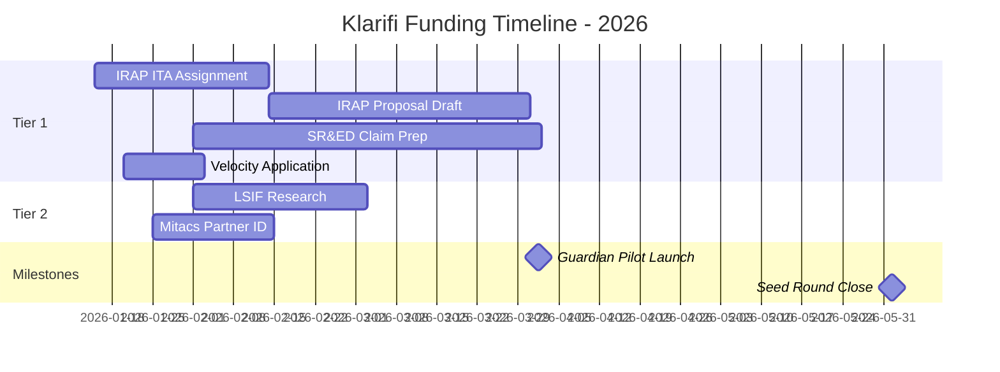
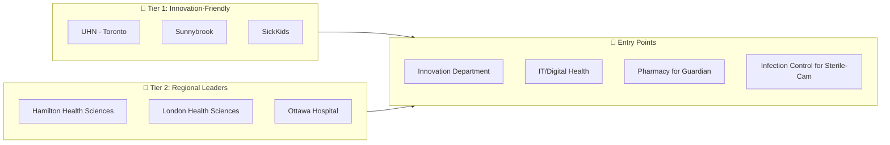
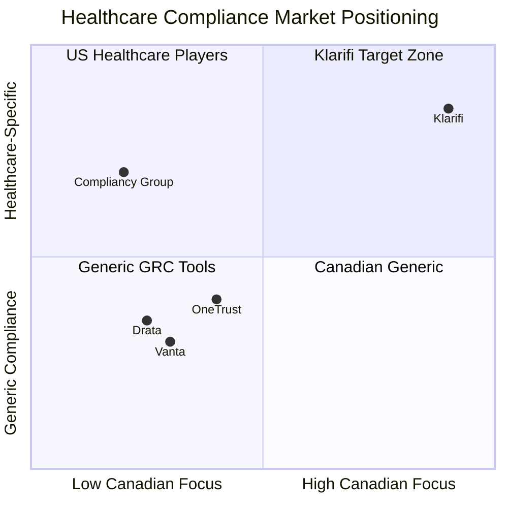

# Klarifi Funding Strategy Map
## Converting Healthcare Compliance Innovation into Investment-Ready SaaS

**Prepared by:** AI Partner Manager (Canadian SaaS Focus)  
**Date:** January 13, 2026  
**Stage:** Pre-Seed to Seed Transition

---

## 1. Executive Positioning

### 1.1 The Fundable Thesis

### 1.2 Investor-Ready Narrative

| Element | Klarifi Positioning |
|---------|---------------------|
| **Problem** | Canadian medical practices face $100K+ fines for PIPEDA/PHIPA violations. Compliance is fragmented, anxiety-inducing, and expensive. |
| **Solution** | AI-powered "Second Brain" that translates regulations into simple "Safety Blocks" with actionable guidance. |
| **Why Now** | Post-COVID digital health acceleration + Privacy law enforcement ramping up in 2025-2026. |
| **Moat** | Only platform combining Canadian data residency + Edge AI hardware + regulatory monitoring. |
| **Business Model** | SaaS ($199/mo per practice) + Hardware (Guardian $2,999, Sterile-Cam $1,999) + Enterprise deals. |
| **Ask** | $500K-$1M Seed to accelerate GTM and ship Guardian hardware. |

---

## 2. Funding Source Tier Matrix

> [!IMPORTANT]
> **Tier 1** sources have the highest probability of funding Klarifi's specific value proposition. Focus 60% of energy here.

### Tier 1: Primary Targets (High Fit)

| Source | Fit Score | Annual Funding | Klarifi Angle |
|--------|-----------|----------------|---------------|
| **IRAP** | 95% | Up to $1M | Edge AI R&D for Guardian hardware |
| **SR&ED** | 90% | 35% refund | Already doing qualifying R&D |
| **Velocity (UofT/McMaster)** | 85% | $100K-$500K | Healthcare AI + Academic healthcare access |
| **ISC Challenges** | 80% | $150K-$1M | Government healthcare modernization |

### Tier 2: Secondary Targets (Good Fit)

| Source | Fit Score | Annual Funding | Klarifi Angle |
|--------|-----------|----------------|---------------|
| **Life Sciences Innovation Fund** | 70% | Up to $200K | Medication adherence focus |
| **Mitacs** | 70% | $15K-$60K/intern | AI/ML research partnerships |
| **NSERC Alliance** | 65% | $50K-$500K | Academic AI research |
| **Ontario Centres of Excellence** | 65% | $100K+ | Healthcare innovation |

### Tier 3: Opportunistic (Monitor)

| Source | Fit Score | Annual Funding | Klarifi Angle |
|--------|-----------|----------------|---------------|
| **FedDev Ontario** | 55% | Varies | Regional tech growth |
| **AI Compute Access Fund** | 50% | Compute credits | Training SLM models |
| **BDC** | 50% | Loans | Growth capital option |

---

## 3. Financial Runway Architecture

### Capital Stack Strategy

| Quarter | Target Capital | Primary Sources | Milestone Unlock |
|---------|----------------|-----------------|------------------|
| Q1 2026 | $150K | SR&ED refund, Guardian deposits | Prototype validation |
| Q2 2026 | $300K | IRAP Phase 1, Velocity | Hospital pilot launch |
| Q3 2026 | $500K | ISC contract, Angel round | Guardian shipping |
| Q4 2026 | $750K | Seed round close | 50 paying clinics |

---

## 4. Hospital Technology Fund (HTF) Deep Dive

### 4.1 Target Hospital Categories

### 4.2 Hospital Partnership Playbook

| Phase | Actions | Timeline |
|-------|---------|----------|
| **Research** | Identify innovation leads, review recent partnerships | Week 1-2 |
| **Warm Intro** | Leverage Velocity/UofT network for introductions | Week 3-4 |
| **Pitch** | Present Guardian pilot proposal (zero risk, full audit) | Week 5-6 |
| **Pilot Agreement** | 90-day trial with 3 pharmacy stations | Week 7-8 |
| **Data Collection** | 948% ROI validation, testimonials | Week 9-20 |
| **Scale** | Enterprise contract + case study for fundraising | Week 21+ |

---

## 5. Pitch Deck Architecture

### Slide Flow (12 slides max)

1. **Cover:** Klarifi - Harmony for Healthcare Compliance
2. **Problem:** The $100K fine waiting in every clinic
3. **Solution:** Safety Blocks + AI Translator + Edge Hardware
4. **Product Demo:** Dashboard "Peace of Mind Meter" screenshot
5. **Market Size:** Canadian healthcare compliance TAM ($2B)
6. **Business Model:** SaaS + Hardware + Enterprise tiers
7. **Traction:** Pre-orders, quiz completions, active users
8. **Competition:** 2x2 matrix (Compliance depth vs. Canadian focus)
9. **Team:** Founder backgrounds, advisory board
10. **Financials:** 18-month runway, unit economics
11. **Ask:** $750K Seed for GTM + Guardian manufacturing
12. **Vision:** The compliance operating system for Canadian healthcare

---

## 6. Key Metrics Dashboard

### Investor-Relevant KPIs

| Metric | Current | 90-Day Target | Why It Matters |
|--------|---------|---------------|----------------|
| **Guardian Deposits** | $X | $25K | Pre-revenue validation |
| **Quiz Completions** | X | 200 | Top-of-funnel engagement |
| **Dashboard MAU** | X | 50 | Product-market fit signal |
| **NRR (Net Revenue Retention)** | N/A | Track | SaaS health indicator |
| **CAC Payback** | N/A | <12 months | Unit economics |
| **Hospital Pilots** | 0 | 2 | Enterprise readiness |

---

## 7. Risk Mitigation Matrix

> [!WARNING]
> Address these investor objections proactively in all pitches.

| Risk | Mitigation Strategy | Proof Point |
|------|---------------------|-------------|
| **Single Geography** | Canada-first, then Commonwealth expansion | PHIPA expertise transfers to UK NHS |
| **Hardware Complexity** | Pre-orders de-risk manufacturing | $750 deposits committed |
| **Competition** | Deep regulatory moat + data residency | Only Canadian-hosted solution |
| **Sales Cycle** | Self-serve onboarding for SMB | Quiz → Trial → Paid in 14 days |
| **Regulatory Change** | Lookout feature monitors real-time | Built-in product response |

---

## 8. Networking Velocity Targets

### Weekly Outreach Cadence

| Category | Target/Week | Channel |
|----------|-------------|---------|
| **Investors** | 3 new connections | LinkedIn, demo days |
| **Hospital Leads** | 2 conversations | Email, warm intros |
| **Program Managers** | 1 touchpoint | IRAP, SR&ED, ISC |
| **Peer Founders** | 2 coffees | Velocity, Communitech |

### Key Networking Events (Q1 2026)

| Event | Date | Objective |
|-------|------|-----------|
| Velocity Demo Day | Feb 2026 | Pitch to 50+ investors |
| Invest Ottawa Healthcare | Mar 2026 | Hospital partner introductions |
| Collision Toronto | June 2026 | Seed round momentum |

---

## 9. Competitive Positioning

### Differentiation Talking Points

1. **Only Canadian data residency** for healthcare compliance
2. **Edge AI hardware** (Guardian, Sterile-Cam) - not just software
3. **"Red Brain" language** reduces compliance anxiety → higher adoption
4. **Provincial expertise** (PHIPA, PIPA) not just HIPAA copy-paste
5. **Immutable audit trails** exceeding regulatory requirements

---

## 10. Next Steps: 30-Day Sprint

### Week 1 (Jan 13-19)
- [ ] Submit IRAP inquiry for ITA assignment
- [ ] Begin SR&ED time tracking documentation
- [ ] Draft Velocity program application

### Week 2 (Jan 20-26)
- [ ] First hospital innovation lead outreach
- [ ] Identify 2 potential Mitacs academic supervisors
- [ ] Finalize pitch deck v1.0

### Week 3 (Jan 27 - Feb 2)
- [ ] IRAP ITA meeting scheduled
- [ ] ISC challenges review for Q1 calls
- [ ] Guardian pre-order campaign launch

### Week 4 (Feb 3-9)
- [ ] Velocity application submitted
- [ ] SR&ED documentation system operational
- [ ] First investor demo scheduled

---

*Strategy Map v1.0 - For review and iteration with founding team*
